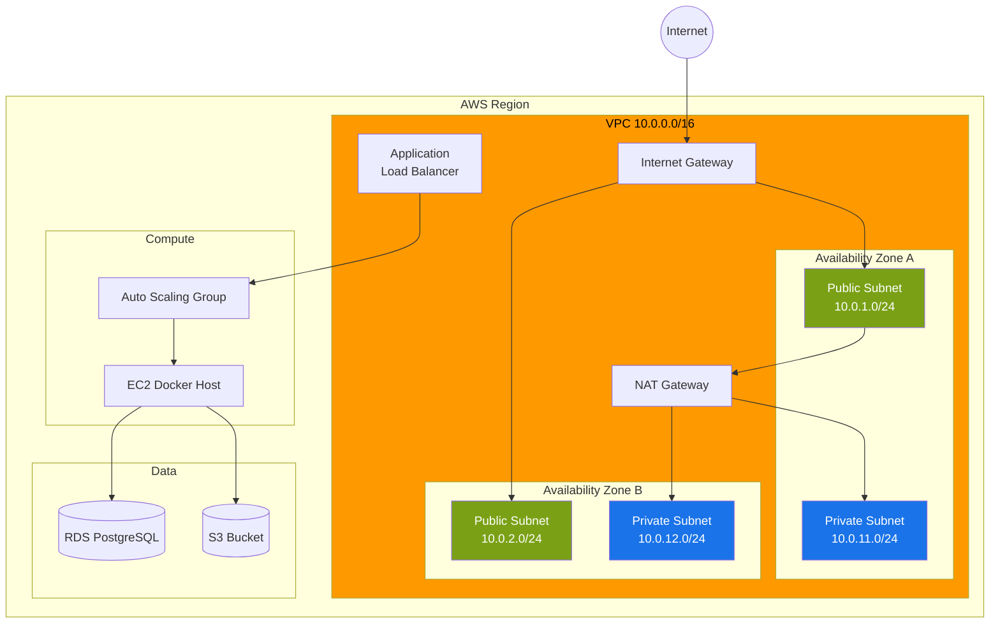
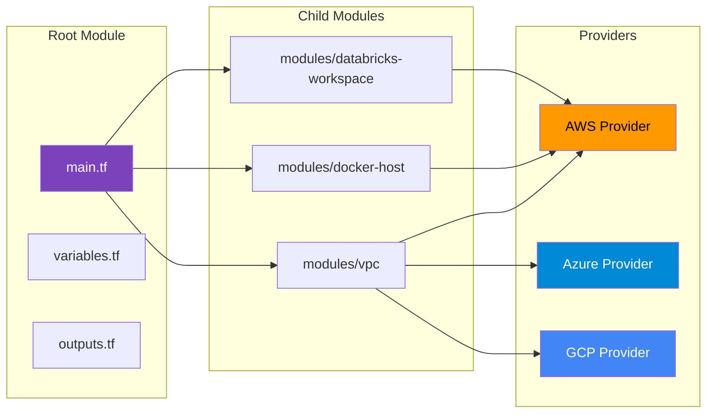

# Infrastructure as Code Demos

[](https://github.com/morgandt-reed/infrastructure-as-code-demos/actions/workflows/terraform-validate.yml)
[](https://opensource.org/licenses/MIT)
[](https://www.terraform.io/)
[](https://aws.amazon.com/)

Production-ready Terraform modules demonstrating multi-cloud infrastructure patterns and best practices.

## Overview

This repository showcases reusable Terraform modules for common infrastructure patterns across AWS, Azure, and GCP. Each module is self-contained, well-documented, and production-ready.

## Architecture

### AWS VPC Infrastructure



### Terraform Module Composition



## Repository Structure

```
.
├── README.md
├── modules/
│   ├── docker-host/            # EC2 instance with Docker pre-installed
│   ├── databricks-workspace/   # Databricks workspace setup
│   └── vpc/                    # Reusable VPC module
├── examples/
│   └── complete-setup/         # Complete infrastructure stack
└── .github/
    └── workflows/
        └── terraform-validate.yml  # CI/CD for validation
```

## Modules

### 1. Docker Host (AWS)
**Path**: [modules/docker-host/](modules/docker-host/)

Creates an EC2 instance with:
- Docker and Docker Compose pre-installed
- Security group with configurable ports
- Optional Elastic IP
- CloudWatch monitoring
- Auto-recovery enabled

**Usage**:
```hcl
module "docker_host" {
  source = "./modules/docker-host"

  instance_name    = "my-docker-host"
  instance_type    = "t3.medium"
  key_name         = "my-key-pair"
  allowed_ssh_cidrs = ["0.0.0.0/0"]

  tags = {
    Environment = "production"
    Project     = "microservices"
  }
}
```

### 2. Databricks Workspace
**Path**: [modules/databricks-workspace/](modules/databricks-workspace/)

Sets up Databricks workspace with:
- Workspace creation
- Cluster policies
- Secret scopes
- IAM roles and policies
- S3 bucket for data storage

**Usage**:
```hcl
module "databricks" {
  source = "./modules/databricks-workspace"

  workspace_name = "data-engineering"
  aws_region     = "us-west-2"
  cluster_policy = "general-purpose"

  tags = {
    Team = "data"
  }
}
```

### 3. VPC
**Path**: [modules/vpc/](modules/vpc/)

Creates a production-ready VPC with:
- Public and private subnets across AZs
- NAT Gateway for private subnet internet access
- VPC endpoints for AWS services
- Flow logs for network monitoring
- Network ACLs

**Usage**:
```hcl
module "vpc" {
  source = "./modules/vpc"

  vpc_name            = "production-vpc"
  vpc_cidr            = "10.0.0.0/16"
  availability_zones  = ["us-west-2a", "us-west-2b"]
  public_subnet_cidrs = ["10.0.1.0/24", "10.0.2.0/24"]
  private_subnet_cidrs = ["10.0.11.0/24", "10.0.12.0/24"]

  enable_nat_gateway = true
  enable_vpn_gateway = false

  tags = {
    Environment = "production"
  }
}
```

## Quick Start

### Prerequisites

- Terraform 1.6+
- AWS CLI configured
- (Optional) Azure CLI
- (Optional) GCP SDK

### Deploy Infrastructure

```bash
# Clone repository
git clone <your-repo-url>
cd infrastructure-as-code-demos

# Navigate to example
cd examples/complete-setup

# Initialize Terraform
terraform init

# Review plan
terraform plan

# Apply changes
terraform apply
```

### Destroy Infrastructure

```bash
terraform destroy
```

## Module Development Guidelines

### 1. Module Structure
Each module should have:
```
module-name/
├── main.tf           # Primary resource definitions
├── variables.tf      # Input variables
├── outputs.tf        # Output values
├── versions.tf       # Terraform and provider versions
├── README.md         # Module documentation
└── examples/         # Usage examples
```

### 2. Variable Naming
- Use descriptive names
- Include descriptions
- Provide defaults where appropriate
- Use validation when needed

### 3. Outputs
- Output all important resource attributes
- Use descriptions
- Consider downstream module needs

### 4. Tagging
- Support resource tagging
- Include default tags
- Merge with user-provided tags

## Best Practices Demonstrated

### 1. State Management
```hcl
terraform {
  backend "s3" {
    bucket         = "my-terraform-state"
    key            = "infrastructure/terraform.tfstate"
    region         = "us-west-2"
    encrypt        = true
    dynamodb_table = "terraform-lock"
  }
}
```

### 2. Variable Validation
```hcl
variable "instance_type" {
  type        = string
  description = "EC2 instance type"

  validation {
    condition     = can(regex("^t3\\.", var.instance_type))
    error_message = "Instance type must be from t3 family."
  }
}
```

### 3. Resource Dependencies
```hcl
resource "aws_instance" "app" {
  # ...
  depends_on = [aws_security_group.app]
}
```

### 4. Conditional Resources
```hcl
resource "aws_eip" "app" {
  count = var.enable_elastic_ip ? 1 : 0
  # ...
}
```

### 5. Dynamic Blocks
```hcl
dynamic "ingress" {
  for_each = var.allowed_ports
  content {
    from_port   = ingress.value
    to_port     = ingress.value
    protocol    = "tcp"
    cidr_blocks = ["0.0.0.0/0"]
  }
}
```

## Security Best Practices

### 1. Secrets Management
```hcl
# Use AWS Secrets Manager
data "aws_secretsmanager_secret_version" "db_password" {
  secret_id = "prod/database/password"
}

# Or use environment variables
variable "database_password" {
  type      = string
  sensitive = true
}
```

### 2. Least Privilege IAM
```hcl
resource "aws_iam_role_policy" "app" {
  name = "app-policy"
  role = aws_iam_role.app.id

  policy = jsonencode({
    Version = "2012-10-17"
    Statement = [
      {
        Effect = "Allow"
        Action = [
          "s3:GetObject",
          "s3:PutObject"
        ]
        Resource = "${aws_s3_bucket.app.arn}/*"
      }
    ]
  })
}
```

### 3. Encryption at Rest
```hcl
resource "aws_s3_bucket_server_side_encryption_configuration" "app" {
  bucket = aws_s3_bucket.app.id

  rule {
    apply_server_side_encryption_by_default {
      sse_algorithm     = "aws:kms"
      kms_master_key_id = aws_kms_key.app.arn
    }
  }
}
```

### 4. Network Isolation
```hcl
resource "aws_security_group" "app" {
  name        = "app-sg"
  description = "Security group for application"
  vpc_id      = module.vpc.vpc_id

  # Only allow specific sources
  ingress {
    from_port   = 443
    to_port     = 443
    protocol    = "tcp"
    cidr_blocks = ["10.0.0.0/16"]  # Internal only
  }
}
```

## Cost Optimization

### 1. Use Spot Instances
```hcl
resource "aws_instance" "worker" {
  instance_market_options {
    market_type = "spot"
    spot_options {
      max_price = "0.05"
    }
  }
}
```

### 2. Auto-scaling
```hcl
resource "aws_autoscaling_group" "app" {
  min_size         = 2
  max_size         = 10
  desired_capacity = 2
  # ...
}
```

### 3. Lifecycle Policies
```hcl
resource "aws_s3_bucket_lifecycle_configuration" "app" {
  bucket = aws_s3_bucket.app.id

  rule {
    id     = "archive-old-logs"
    status = "Enabled"

    transition {
      days          = 30
      storage_class = "GLACIER"
    }

    expiration {
      days = 90
    }
  }
}
```

## Multi-Cloud Support

### AWS Example
```hcl
provider "aws" {
  region = "us-west-2"
}

resource "aws_instance" "app" {
  ami           = "ami-0c55b159cbfafe1f0"
  instance_type = "t3.micro"
}
```

### Azure Example
```hcl
provider "azurerm" {
  features {}
}

resource "azurerm_virtual_machine" "app" {
  name                  = "app-vm"
  location              = "West US"
  resource_group_name   = azurerm_resource_group.main.name
  vm_size               = "Standard_B2s"
}
```

### GCP Example
```hcl
provider "google" {
  project = "my-project"
  region  = "us-central1"
}

resource "google_compute_instance" "app" {
  name         = "app-instance"
  machine_type = "e2-medium"
  zone         = "us-central1-a"
}
```

## CI/CD Integration

### GitHub Actions Workflow
**File**: [.github/workflows/terraform-validate.yml](.github/workflows/terraform-validate.yml)

```yaml
name: Terraform Validation

on: [push, pull_request]

jobs:
  validate:
    runs-on: ubuntu-latest
    steps:
      - uses: actions/checkout@v3
      - uses: hashicorp/setup-terraform@v2
      - run: terraform fmt -check
      - run: terraform init
      - run: terraform validate
```

## Testing

### Terraform Validate
```bash
terraform validate
```

### Terraform Format Check
```bash
terraform fmt -check -recursive
```

### Security Scanning
```bash
# Install tfsec
brew install tfsec

# Scan for security issues
tfsec .
```

### Cost Estimation
```bash
# Install infracost
brew install infracost

# Estimate costs
infracost breakdown --path .
```

## Environment Separation

### Workspace-based
```bash
terraform workspace new dev
terraform workspace new prod
terraform workspace select dev
```

### Directory-based
```
environments/
├── dev/
│   ├── main.tf
│   └── terraform.tfvars
├── staging/
│   ├── main.tf
│   └── terraform.tfvars
└── prod/
    ├── main.tf
    └── terraform.tfvars
```

### Variable Files
```bash
# Development
terraform apply -var-file="dev.tfvars"

# Production
terraform apply -var-file="prod.tfvars"
```

## Troubleshooting

### Common Issues

**State Lock**:
```bash
# If state is locked
terraform force-unlock <lock-id>
```

**Drift Detection**:
```bash
# Check for configuration drift
terraform plan -detailed-exitcode
```

**Import Existing Resources**:
```bash
terraform import aws_instance.app i-1234567890abcdef0
```

**Debugging**:
```bash
# Enable detailed logging
export TF_LOG=DEBUG
terraform apply
```

## Real-World Use Cases

### Complete Application Stack
```
VPC → Subnets → Security Groups → ALB → ASG → RDS → S3
```

### Data Platform
```
VPC → Databricks Workspace → S3 Data Lake → Glue Catalog
```

### Microservices Platform
```
VPC → EKS Cluster → RDS → ElastiCache → S3
```

## Trade-offs and Design Decisions

### Why Terraform?
- Cloud-agnostic (mostly)
- Large provider ecosystem
- State management built-in
- HCL is declarative and readable
- Strong community and tooling

### When NOT to Use Terraform
- Simple scripts (use Bash/Python)
- Configuration management (use Ansible)
- Application deployment (use K8s/Helm)

### Module Design Philosophy
- **Composability**: Small, focused modules
- **Reusability**: Parameterized and flexible
- **Simplicity**: Not over-engineered
- **Documentation**: Self-documenting code

## Next Steps

- [ ] Add Azure modules
- [ ] Add GCP modules
- [ ] Implement Terratest for automated testing
- [ ] Add Sentinel policies for compliance
- [ ] Create private module registry
- [ ] Add disaster recovery patterns

## Resources

- [Terraform Documentation](https://www.terraform.io/docs/)
- [AWS Provider Docs](https://registry.terraform.io/providers/hashicorp/aws/latest/docs)
- [Terraform Best Practices](https://www.terraform-best-practices.com/)
- [Terraform Module Registry](https://registry.terraform.io/)

## License

MIT License - see [LICENSE](LICENSE) for details

---

**Built to demonstrate production-ready infrastructure as code patterns for multi-cloud deployments.**
