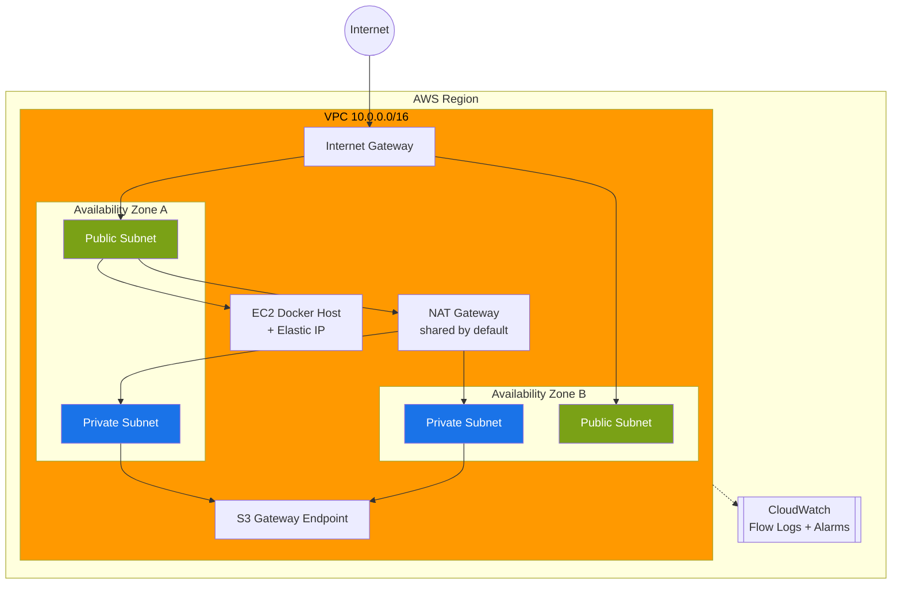
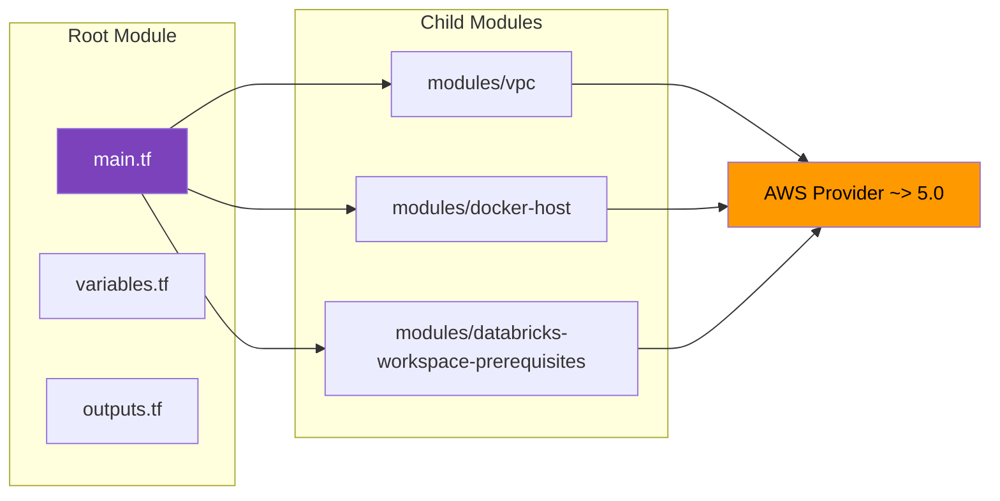

# Infrastructure as Code Demos

[](https://github.com/morgandt-reed/infrastructure-as-code-demos/actions/workflows/terraform-validate.yml)
[](https://opensource.org/licenses/MIT)
[](https://www.terraform.io/)
[](https://aws.amazon.com/)

Three reusable AWS Terraform modules and a working example that composes them.

## Overview

**AWS only.** There are no Azure or GCP modules here, and the only provider any
module declares is `hashicorp/aws ~> 5.0`.

Everything is checked in CI with no escape hatches: `terraform fmt -check
-recursive`, `terraform init` + `validate` for each module and the example,
TFLint's recommended Terraform ruleset, and a Trivy config scan that fails the
build on any HIGH or CRITICAL finding. The two accepted risks are annotated
inline with `#trivy:ignore:<id>` and a written justification, so a new finding
still turns the build red.

What is **not** here: no `terraform test` suites, no Terratest, no automated
`plan` against a real account. "Valid and scan-clean" is the claim; "applies
cleanly to AWS" is not verified by CI.

## Architecture

### What `examples/complete-setup` builds


```mermaid
flowchart TB
    subgraph AWS Region
        subgraph VPC[VPC 10.0.0.0/16]
            subgraph AZ1[Availability Zone A]
                PubSub1[Public Subnet]
                PrivSub1[Private Subnet]
            end
            subgraph AZ2[Availability Zone B]
                PubSub2[Public Subnet]
                PrivSub2[Private Subnet]
            end

            IGW[Internet Gateway]
            NAT[NAT Gateway<br/>shared by default]
            EC2[EC2 Docker Host<br/>+ Elastic IP]
            S3EP[S3 Gateway Endpoint]
        end

        FlowLogs[[CloudWatch<br/>Flow Logs + Alarms]]
    end

    Internet((Internet)) --> IGW
    IGW --> PubSub1 & PubSub2
    PubSub1 --> NAT
    NAT --> PrivSub1 & PrivSub2
    PubSub1 --> EC2
    PrivSub1 & PrivSub2 --> S3EP
    VPC -.-> FlowLogs

    style VPC fill:#FF9900,color:#000
    style PubSub1 fill:#7AA116,color:#fff
    style PubSub2 fill:#7AA116,color:#fff
    style PrivSub1 fill:#1A73E8,color:#fff
    style PrivSub2 fill:#1A73E8,color:#fff
```

Subnet CIDRs are derived with `cidrsubnet(var.vpc_cidr, 4, n)` rather than
hardcoded, so they follow whatever `vpc_cidr` and `az_count` you set. Nothing
here creates an ALB, an Auto Scaling Group or an RDS instance.

### Terraform Module Composition


```mermaid
flowchart LR
    subgraph Root Module
        Main[main.tf]
        Vars[variables.tf]
        Out[outputs.tf]
    end

    subgraph Child Modules
        VPC[modules/vpc]
        Docker[modules/docker-host]
        DB[modules/databricks-workspace-prerequisites]
    end

    AWS[AWS Provider ~> 5.0]

    Main --> VPC & Docker & DB
    VPC & Docker & DB --> AWS

    style Main fill:#7B42BC,color:#fff
    style AWS fill:#FF9900,color:#000
```

The root module in that diagram is
[`examples/complete-setup/`](examples/complete-setup/).

## Repository Structure

```
.
├── README.md
├── .tflint.hcl
├── modules/
│   ├── vpc/                                    # VPC, subnets, NAT, flow logs
│   ├── docker-host/                            # EC2 with Docker + Compose
│   └── databricks-workspace-prerequisites/     # AWS side of a Databricks workspace
├── examples/
│   └── complete-setup/                         # Composes all three
└── .github/
    └── workflows/
        └── terraform-validate.yml
```

Every module has `main.tf`, `variables.tf`, `outputs.tf`, `versions.tf` and a
`README.md`. Usage examples live in each module's README and in
`examples/complete-setup/`; there is no per-module `examples/` directory.

## Modules

### 1. VPC
**Path**: [modules/vpc/](modules/vpc/)

- Public, private and optional database subnets across `az_count` AZs, with
  non-overlapping CIDRs derived by `cidrsubnet` rather than hand-written lists
- NAT Gateways: one per AZ, or a single shared one (`single_nat_gateway`), or
  none — the route tables and EIPs follow the choice
- VPC Flow Logs end to end: log group, IAM role, scoped policy
- S3 gateway endpoint, associated with every route table
- Network ACLs for public and private tiers
- Nine `validation` blocks on the inputs

```hcl
module "vpc" {
  source = "../../modules/vpc"

  name     = "production"
  vpc_cidr = "10.0.0.0/16"
  az_count = 3

  enable_nat_gateway      = true
  single_nat_gateway      = false
  create_database_subnets = true
  enable_flow_logs        = true
  enable_s3_endpoint      = true

  tags = {
    Environment = "production"
  }
}
```

### 2. Docker Host
**Path**: [modules/docker-host/](modules/docker-host/)

- Ubuntu 22.04, latest Canonical AMI, with `ignore_changes = [ami]` so a new
  AMI release does not silently replace a running instance
- Encrypted gp3 root volume, IMDSv2 required
- Docker Engine and a `docker-compose` shim installed by user-data
- Instance profile with `CloudWatchAgentServerPolicy` and (by default)
  `AmazonSSMManagedInstanceCore`, so Session Manager replaces SSH —
  `allowed_ssh_cidrs` defaults to empty and creates no SSH rule at all
- Each entry in `additional_ports` carries its own CIDR list; the module never
  defaults an extra port to `0.0.0.0/0`
- Optional Elastic IP and two CloudWatch alarms, which take `alarm_actions`

```hcl
module "docker_host" {
  source = "../../modules/docker-host"

  instance_name = "my-docker-host"
  instance_type = "t3.medium"

  vpc_id    = module.vpc.vpc_id
  subnet_id = module.vpc.public_subnet_ids[0]

  additional_ports = [
    {
      port        = 8080
      cidr_blocks = ["10.0.0.0/16"]
      description = "Application port, VPC-internal only"
    }
  ]

  alarm_actions = [aws_sns_topic.ops.arn]

  tags = {
    Environment = "production"
  }
}
```

### 3. Databricks Workspace Prerequisites
**Path**: [modules/databricks-workspace-prerequisites/](modules/databricks-workspace-prerequisites/)

Creates the **AWS-side** resources a Databricks E2 workspace needs: root S3
bucket, cross-account IAM role, cluster instance profile, security group.

It does **not** create a workspace — no `databricks_*` resource is declared and
the Databricks provider is not configured. Feed its outputs into
`databricks_mws_credentials`, `databricks_mws_storage_configurations`,
`databricks_mws_networks` and `databricks_mws_workspaces` from a configuration
that has account-level Databricks credentials. The module's README shows exactly
that. It was previously called `databricks-workspace`, which overstated it.

```hcl
module "databricks_prereqs" {
  source = "../../modules/databricks-workspace-prerequisites"

  workspace_name        = "data-engineering"
  environment           = "prod"
  databricks_account_id = var.databricks_account_id

  vpc_id     = module.vpc.vpc_id
  subnet_ids = module.vpc.private_subnet_ids

  tags = {
    Team = "data"
  }
}
```

## Quick Start

### Prerequisites

- Terraform 1.6+ (the modules use `optional()` in object types, which needs 1.3+)
- AWS CLI configured

### Deploy Infrastructure

```bash
git clone <your-repo-url>
cd infrastructure-as-code-demos/examples/complete-setup

cp terraform.tfvars.example terraform.tfvars
# edit terraform.tfvars

terraform init
terraform plan
terraform apply
```

This applies real, billable resources — a NAT Gateway, an Elastic IP and an EC2
instance. See [the example's README](examples/complete-setup/README.md) for the
cost breakdown.

### Destroy Infrastructure

```bash
terraform destroy
```

## Module Development Guidelines

### 1. Module Structure
Each module here has:
```
module-name/
├── main.tf           # Primary resource definitions
├── variables.tf      # Input variables
├── outputs.tf        # Output values
├── versions.tf       # Terraform and provider versions
└── README.md         # Documentation, including a usage example
```

### 2. Variable Naming
- Use descriptive names
- Include descriptions
- Provide defaults where appropriate
- Use validation when needed

### 3. Outputs
- Output all important resource attributes
- Use descriptions
- Consider downstream module needs

### 4. Tagging
- Support resource tagging
- Include default tags
- Merge with user-provided tags

## Best Practices Demonstrated

### 1. State Management
```hcl
terraform {
  backend "s3" {
    bucket         = "my-terraform-state"
    key            = "infrastructure/terraform.tfstate"
    region         = "us-west-2"
    encrypt        = true
    dynamodb_table = "terraform-lock"
  }
}
```

### 2. Variable Validation
```hcl
variable "instance_type" {
  type        = string
  description = "EC2 instance type"

  validation {
    condition     = can(regex("^t3\\.", var.instance_type))
    error_message = "Instance type must be from t3 family."
  }
}
```

### 3. Resource Dependencies
```hcl
resource "aws_instance" "app" {
  # ...
  depends_on = [aws_security_group.app]
}
```

### 4. Conditional Resources
```hcl
resource "aws_eip" "app" {
  count = var.enable_elastic_ip ? 1 : 0
  # ...
}
```

### 5. Dynamic Blocks

From `modules/docker-host`. Note that the CIDR list comes from the caller —
defaulting it to `0.0.0.0/0` inside a dynamic block is how a module quietly
opens every extra port to the internet:

```hcl
dynamic "ingress" {
  for_each = { for p in var.additional_ports : tostring(p.port) => p }
  content {
    description = coalesce(ingress.value.description, "Custom port ${ingress.value.port}")
    from_port   = ingress.value.port
    to_port     = ingress.value.port
    protocol    = "tcp"
    cidr_blocks = ingress.value.cidr_blocks
  }
}
```

The same pattern renders a block zero times when a list is empty, which is how
`allowed_ssh_cidrs = []` produces no SSH rule instead of an ingress rule with no
sources (which the EC2 API rejects).

## Security Best Practices

### 1. Secrets Management
```hcl
# Use AWS Secrets Manager
data "aws_secretsmanager_secret_version" "db_password" {
  secret_id = "prod/database/password"
}

# Or use environment variables
variable "database_password" {
  type      = string
  sensitive = true
}
```

### 2. Least Privilege IAM
```hcl
resource "aws_iam_role_policy" "app" {
  name = "app-policy"
  role = aws_iam_role.app.id

  policy = jsonencode({
    Version = "2012-10-17"
    Statement = [
      {
        Effect = "Allow"
        Action = [
          "s3:GetObject",
          "s3:PutObject"
        ]
        Resource = "${aws_s3_bucket.app.arn}/*"
      }
    ]
  })
}
```

### 3. Encryption at Rest
```hcl
resource "aws_s3_bucket_server_side_encryption_configuration" "app" {
  bucket = aws_s3_bucket.app.id

  rule {
    apply_server_side_encryption_by_default {
      sse_algorithm     = "aws:kms"
      kms_master_key_id = aws_kms_key.app.arn
    }
  }
}
```

### 4. Network Isolation
```hcl
resource "aws_security_group" "app" {
  name        = "app-sg"
  description = "Security group for application"
  vpc_id      = module.vpc.vpc_id

  # Only allow specific sources
  ingress {
    from_port   = 443
    to_port     = 443
    protocol    = "tcp"
    cidr_blocks = ["10.0.0.0/16"]  # Internal only
  }
}
```

## Cost Optimization

### 1. Use Spot Instances
```hcl
resource "aws_instance" "worker" {
  instance_market_options {
    market_type = "spot"
    spot_options {
      max_price = "0.05"
    }
  }
}
```

### 2. Auto-scaling
```hcl
resource "aws_autoscaling_group" "app" {
  min_size         = 2
  max_size         = 10
  desired_capacity = 2
  # ...
}
```

### 3. Lifecycle Policies
```hcl
resource "aws_s3_bucket_lifecycle_configuration" "app" {
  bucket = aws_s3_bucket.app.id

  rule {
    id     = "archive-old-logs"
    status = "Enabled"

    transition {
      days          = 30
      storage_class = "GLACIER"
    }

    expiration {
      days = 90
    }
  }
}
```

## CI/CD Integration

**File**: [.github/workflows/terraform-validate.yml](.github/workflows/terraform-validate.yml)

Four jobs, none of which can be satisfied by a command that always succeeds:

| Job | What it runs |
|---|---|
| `fmt` | `terraform fmt -check -recursive -diff` |
| `validate` | `terraform init -backend=false` + `validate`, as a matrix over all three modules and the example |
| `tflint` | TFLint's bundled Terraform ruleset, `recommended` preset, over every module and example |
| `security` | `trivy config` with `severity: CRITICAL,HIGH` and `exit-code: 1` |

Trivy replaced tfsec, which is deprecated and was running here with
`soft_fail: true` — reporting findings while always passing. The two risks that
are genuinely accepted (unrestricted egress on the Docker host and the Databricks
cluster SG; `map_public_ip_on_launch` on public subnets) are annotated inline
with `#trivy:ignore:<id>` and a justification, so they are visible in review and
a new finding still fails the build.

## Testing

Everything CI does, locally:

```bash
terraform fmt -check -recursive

for d in modules/*/ examples/*/; do
  terraform -chdir="$d" init -backend=false && terraform -chdir="$d" validate
done

tflint --init
for d in modules/*/ examples/*/; do
  tflint --chdir="$d" --config="$(pwd)/.tflint.hcl"
done

trivy config --severity CRITICAL,HIGH --exit-code 1 .
```

There are no `terraform test` suites or Terratest coverage yet — see Next Steps.

### Cost Estimation
```bash
brew install infracost
infracost breakdown --path examples/complete-setup
```

## Environment Separation

### Workspace-based
```bash
terraform workspace new dev
terraform workspace new prod
terraform workspace select dev
```

### Directory-based
```
environments/
├── dev/
│   ├── main.tf
│   └── terraform.tfvars
├── staging/
│   ├── main.tf
│   └── terraform.tfvars
└── prod/
    ├── main.tf
    └── terraform.tfvars
```

### Variable Files
```bash
# Development
terraform apply -var-file="dev.tfvars"

# Production
terraform apply -var-file="prod.tfvars"
```

## Troubleshooting

### Common Issues

**State Lock**:
```bash
# If state is locked
terraform force-unlock <lock-id>
```

**Drift Detection**:
```bash
# Check for configuration drift
terraform plan -detailed-exitcode
```

**Import Existing Resources**:
```bash
terraform import aws_instance.app i-1234567890abcdef0
```

**Debugging**:
```bash
# Enable detailed logging
export TF_LOG=DEBUG
terraform apply
```

## Real-World Use Cases

### Complete Application Stack
```
VPC → Subnets → Security Groups → ALB → ASG → RDS → S3
```

### Data Platform
```
VPC → Databricks Workspace → S3 Data Lake → Glue Catalog
```

### Microservices Platform
```
VPC → EKS Cluster → RDS → ElastiCache → S3
```

## Design decisions

Recorded as ADRs in [`docs/adr/`](docs/adr/):

- [ADR-0001](docs/adr/0001-bootstrap-before-terraform.md) — **bootstrap is an
  explicit one-time phase before any `terraform init`, producing enabled APIs, an
  enumerated least-privilege provisioning identity, a versioned state bucket
  scoped to that identity, and a federated trust relationship instead of a key.**
  *(Proposed — this repository has no bootstrap phase and defaults to local
  state.)*
- [ADR-0002](docs/adr/0002-eliminate-the-secret.md) — **modules default to
  platform-native workload identity, so a stored credential is an explicitly
  configured departure rather than the path a caller gets by doing nothing.**
  *(Accepted, partially implemented — Session Manager replaces SSH on the Docker
  host, and the Databricks integration uses a cross-account role rather than
  keys.)*

## Trade-offs and Design Decisions

### Why Terraform?
- One tool across providers, even though this repo only uses AWS
- Large provider ecosystem
- State management built-in
- HCL is declarative and readable
- Strong community and tooling

### When NOT to Use Terraform
- Simple scripts (use Bash/Python)
- Configuration management (use Ansible)
- Application deployment (use K8s/Helm)

### Module Design Philosophy
- **Composability**: Small, focused modules
- **Reusability**: Parameterized and flexible
- **Simplicity**: Not over-engineered
- **Documentation**: Self-documenting code

## Next Steps

- [ ] `terraform test` suites for the VPC module's branching: NAT on/off/single,
      CIDR math at each `az_count`, flow logs on/off
- [ ] A `terraform plan` job in CI against a sandbox account via OIDC, so the
      badge covers more than schema validity
- [ ] Bucket policy for the Databricks root bucket, and a GovCloud-aware
      cross-account principal
- [ ] Add Azure or GCP modules, or drop the ambition — right now this is an AWS
      repository and says so

## Resources

- [Terraform Documentation](https://www.terraform.io/docs/)
- [AWS Provider Docs](https://registry.terraform.io/providers/hashicorp/aws/latest/docs)
- [Terraform Best Practices](https://www.terraform-best-practices.com/)
- [Terraform Module Registry](https://registry.terraform.io/)

## License

MIT License - see [LICENSE](LICENSE) for details
